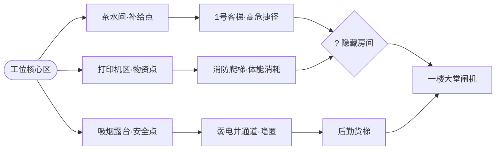

# 《逃离大厂》玩法扩展系统设计规范（GDD）

> **版本**：v2.0-Draft  
> **状态**：设计就绪（Ready for Review & Implementation）  
> **基线工程**：`escape-work v1.0` (Vite + Vanilla JS + CSS)

---

## 目录
1. [系统一：分支节点地图系统（Map & Node Navigation）](#系统一分支节点地图系统map--node-navigation)
2. [系统二：职场人脉网络与好感度系统（NPC Relationship System）](#系统二职场人脉网络与好感度系统npc-relationship-system)
3. [系统三：道具羁绊与合成系统（Item Synergy & Crafting）](#系统三道具羁绊与合成系统item-synergy--crafting)
4. [系统四：交互微玩法（黑话对决、红包避雷与打卡QTE）](#系统四交互微玩法黑话对决红包避雷与打卡qte)
5. [系统五：动态巡逻视野与声东击西机制（Boss Patrol & Decoys）](#系统五动态巡逻视野与声东击西机制boss-patrol--decoys)
6. [系统六：每日职场黄历与混沌词缀叠加（Daily Run & Chaos Affixes）](#系统六每日职场黄历与混沌词缀叠加daily-run--chaos-affixes)
7. [系统七：新模式扩展（阎总抓人模式与深夜通宵绝地求生）](#系统七新模式扩展阎总抓人模式与深夜通宵绝地求生)

---

## 系统一：分支节点地图系统（Map & Node Navigation）

### 1.1 设计目标
改变现存固定的单一线性区域推进模式（工位 $\to$ 走廊 $\to$ 电梯厅 $\to$ 大堂），通过类《杀戮尖塔》（Slay the Spire）的**阶段性有向无环图（DAG）**，让玩家在每局游戏中面临截然不同的逃跑路线规划决策。

### 1.2 节点类型规范

| 节点类型 | 图标 | 功能说明 | 遭遇概率权重 |
| :--- | :--- | :--- | :--- |
| **常规行动点 (Action)** | 💼 | 提供 3~4 个常规战术行动，消耗体力与时间。 | 40% |
| **物资搜寻点 (Loot)** | 📦 | 保底获得 1 件装备或消耗品，附带低概率警报事件。 | 20% |
| **茶水补给点 (Rest)** | ☕ | 可执行恢复操作（接水、小憩、吃点心），回复 15~30 体力。 | 15% |
| **神秘事件点 (Event)** | ❓ | 触发随机事件、隐藏奇遇、高管突击或特殊抉择。 | 15% |
| **隐藏特权房 (Secret)** | 🗝️ | 需满足特定条件（如持有工卡/发夹钥匙），直通无守卫通道。 | 10% |

### 1.3 核心路线分支特性
1. **研发暗道线**：`工位 -> 吸烟区露台 -> 消防安全梯 -> 绿化带侧门`
   * *特点*：避开所有管理层视野，怀疑度上升极慢；但体力消耗额外增加 35%。
2. **行政中枢线**：`工位 -> 总裁办隔壁打印区 -> 行政前台 -> 旋转正门`
   * *特点*：高级物资刷新率极高，但阎总与HR刘姐出现率提升 100%。
3. **后勤潜行线**：`工位 -> 备餐间后门 -> 员工布草货梯 -> B2地下车库`
   * *特点*：需要【保洁主管工卡】或【软中华】方可开门，成功后直接跳过一楼闸机。

### 1.4 随机生成算法规则
* **层级深度**：固定为 5 层（Zone 1: 初始工位 $\to$ Zone 2: 走廊分岔 $\to$ Zone 3: 纵向枢纽 $\to$ Zone 4: 大堂过渡 $\to$ Zone 5: 逃生出口）。
* **分支度**：每层生成 2~3 个节点，上一层每个节点随机连接 1~2 个下一层相邻节点，保证绝无死胡同。
* **节点可见性**：玩家始终能预判未来 2 层的节点类型与高管潜在威胁标记（⚠️ 危险区域）。

---

## 系统二：职场人脉网络与好感度系统（NPC Relationship System）

### 2.1 阵营与关系度划分
关系度区间为 `[-100, +100]`，初始值基于所选职业各有偏移：

| NPC 角色 | 默认初始关系 | 敌友倾向 | 关键收买道具 | 关系度满级专属特权 (+80 以上) | 关系破裂惩罚 (-50 以下) |
| :--- | :---: | :---: | :--- | :--- | :--- |
| **摸鱼盟友阿伟** | +40 | 坚固盟友 | 卫龙大面筋、快乐水 | 在微信群/工位主动替你发声拉仇恨，抵挡 1 次高管盘问 | 拒绝分享摸鱼情报，甚至被动连累暴露你 |
| **保安老王** | 0 | 中立守卫 | 一盒软中华、绿茶 | 开启一楼侧门专属通道，赠送对讲机报点 | 启动主闸机人脸识别严查，怀疑度判定门槛降低 20% |
| **行政阿花 & 财务小敏** | +10 | 友善情报员 | 芝士蛋糕、热拿铁 | 实时通报全司高管巡场动向表，附送零食回血 | 在大堂前台处大声打招呼：“小李你怎么走这么早呀？” |
| **需求刺客阿强** | -20 | 潜在敌对 | 紧急故障工单、冰美式 | 阿强直接陷入“崇拜李哥”状态，本局不再追击你改需求 | 化身走廊怨灵，强制拦截并触发“紧急排期”高难度判定 |
| **HR总监刘姐** | -30 | 职场天敌 | 劳动法典、价值观大饼 | 认可你的“企业文化觉悟”，主动向阎总夸赞并放行 | 强制拉入小会议室灵魂拷问，怀疑度飙升且无法撤退 |

### 2.2 好感度增减动作矩阵
* **投喂与赠礼**：在偶遇或同区域时出示对应道具（好感度 `+25~+40`）。
* **黑话与画饼忽悠成功**：好感度 `+10`，但如果忽悠失败或被识破，好感度 `-30`。
* **甩锅行为**：在事件中选择“出卖阿伟”或“嫁祸阿强”，好感度直接 `-45`。

---

## 系统三：道具羁绊与合成系统（Item Synergy & Crafting）

### 3.1 合成界面交互规则
* 玩家在工位区（Zone 1）或物资点（Loot）可点击背包界面的 **【职场妙手合成】** 按钮。
* 放入任意两件或三件符合配方的物品，无损合成上位神装。如果不符合配方，提示“两件物品无法产生职场化学反应”并返还物品。

### 3.2 核心合成配方设计

| 产物名称 | 原料配方 | 稀有度 | 道具类型 | 专属强力效果（Synergy Effect） |
| :--- | :--- | :---: | :---: | :--- |
| **⚡ 赛博兴奋剂** | `提神风油精` + `温热马克杯` | SSR | 立即使用 | 立即恢复 40 点体力，后续 4 次行动体力消耗降为 0，行动不计入时间推移！ |
| **🕴️ 究极替身傀儡** | `椅背常驻外套` + `降噪大耳机` | SR | 工位留置 | 放置在工位。老板巡视工位时怀疑度增加彻底锁定为 0，且每回合吸引老板注意力 1 次。 |
| **💣 职场正道核弹** | `便携版《劳动法》` + `离职交接清单草稿` | SSR | 被动武器 | 面对任意高管（阎总/刘姐）拦截，强制出现【正道降维打击】选项，胜率 100% 且全场怀疑度 -50%。 |
| **🛴 顺丰闪送全家桶**| `黄色反光马甲` + `卫龙大面筋` | SR | 穿戴伪装 | 伪装完美度 100%，大堂保安和前台完全视你为空气，直接解锁专用货运滑梯通道。 |
| **☕ 架构师无敌气场**| `厚重的项目策划书` + `防蓝光深色墨镜` | R | 穿戴被动 | 走廊行走时所有路过同事投来敬仰目光，怀疑度每回合自然衰减 3%。 |

---

## 系统四：交互微玩法（黑话对决、红包避雷与打卡QTE）

### 4.1 职场黑话大乱斗（Buzzword Battle）
* **触发场景**：偶遇高管（刘姐/阎总/各级总监）盘问时，玩家选择【黑话对线】策略。
* **核心玩法**：
  1. 屏幕上方显示高管提问，例如：“小李，你负责的业务板块这个季度有什么核心交付物？”
  2. 屏幕下方随机弹出 6 块黑话词牌（例如：`底层逻辑`、`顶层设计`、`颗粒度`、`生态闭环`、`差异化打法`、`赋能抓手`）。
  3. 倒计时 6 秒内，玩家需要按语法逻辑点击 3 块词牌组合成句。
* **得分机制**：
  $$\text{黑话离谱度} = \sum (\text{词汇高级权重}) \times \text{职业契合系数}$$
  * 得分 $\ge 80$：**大获全胜**。高管被震慑得连连点头并原地掏出手机做笔记，怀疑度 $-15\%$，直接过关。
  * 得分 $50 \sim 79$：**勉强过关**。高管半信半疑，怀疑度 $+5\%$，放行。
  * 得分 $< 50$：**破绽百出**。语无伦次被高管当场戳穿，怀疑度 $+25\%$。

### 4.2 微信群红包排雷小游戏（Red Packet Minefield）
* **触发场景**：阎总在大群突发“冲刺攻坚红包”。
* **规则**：
  * 屏幕弹窗显示 3 个跳动红包，玩家有 3 秒倒计时做决定：
    * **选项 A：忍住不点** $\to$ 安全无事，但如果本局阿伟好感度低，阿伟可能会在群里艾特你：“@小李 怎么不抢？”导致被盯上。
    * **选项 B：抢第 1 个（抢先头彩）** $\to$ 70% 概率是 0.01 元并被阎总抓壮丁；30% 概率是 88 元暴富并振奋士气（体力 +20）。
    * **选项 C：掐表抢最后一个（垫后捡漏）** $\to$ 80% 概率安全分得 2.5 元，20% 概率红包已领完。

### 4.3 18:00 完美压线打卡停表 QTE（Clock-out QTE）
* **触发场景**：在一楼大堂闸机处执行【人脸识别闸机打卡】。
* **交互形式**：
  * 屏幕正中出现一个高精度的数字时钟毫秒秒表，时间从 `17:59:58.200` 快速向 `18:00:03.000` 滚动。
  * 玩家点击巨型【打卡】按钮定格时间。
* **判定结果**：
  * **PERFECT** (`17:59:59.800` ~ `18:00:00.500`)：触发“准点神仙”华丽特效，本局结算积分翻倍，直接解锁 SSS 级结局！
  * **EARLY** ($< 17:59:59.000$)：被系统判定为早退，前台喇叭大声播报“考勤异常，已抄送HR”，怀疑度飙升至 99%。
  * **LATE** ($> 18:01:00.000$)：下班人流激增，容易在大堂被乘专梯下楼的高管堵截。

---

## 系统五：动态巡逻视野与声东击西机制（Boss Patrol & Decoys）

### 5.1 巡视雷达与动线机制
* **Boss 位置追踪器**：游戏界面顶部常驻【大厦巡查监控简报】：
  * 示例播报：“[17:48] 阎总正在 19 楼训斥运营总监，距离本层还有 2 个楼层”
  * 示例播报：“[17:53] 阎总已搭乘 1 号高管专梯下行，预计 2 分钟后抵达 18 楼电梯厅”
* **动态威胁等级**：
  * 🟢 **安全**：高管在其他楼层或闭门开会，偶遇率 $5\%$。
  * 🟡 **警戒**：高管在本层巡视但相隔较远，偶遇率 $25\%$。
  * 🔴 **极度危险**：高管与玩家处于相邻节点，偶遇率 $70\%$，且无法使用高声量行动。

### 5.2 声东击西战术（Decoys）
玩家可通过场景道具或环境交互制造诱饵，引开老板：
1. **伪造高危告警短信**：使用手机向运维大群发送伪造日志，诱使阎总奔赴 15 楼核心机房（清空本层威胁 3 个回合）。
2. **会议室虚晃一枪**：在飞书日历上给高管预约“紧急预算审批会”，高管将在特定节点静止等待 5 个回合。
3. **制造打印机火警**：让打印机狂喷废纸引起全层骚动，将所有路人视线吸引至走廊另一端。

---

## 系统六：每日职场黄历与混沌词缀叠加（Daily Run & Chaos Affixes）

### 6.1 每日职场黄历（Seeded Daily Run）
* **种子生成机制**：以客户端当日日期字符串（如 `2026-10-09`）作为伪随机发生器（PRNG）种子，确保全球玩家当日挑战相同的关卡地图与词缀配置。
* **黄历宜忌属性**：
  * **今日宜**：如厕（体力恢复翻倍）、戴降噪耳机（免疫HR盘问）。
  * **今日忌**：回复钉钉（怀疑度增长翻倍）、走1号客梯（必定遭遇阎总）。
* **结算排行榜**：根据玩家逃脱耗时、剩余体力、剩余怀疑度与拾取物资计算综合【摸鱼功力评分】，支持本地与在线天梯榜展示。

### 6.2 混沌词缀叠加模式（Chaos Modifier Stacking）
在修罗场模式（Hardcore）或自定义沙盒模式中，支持同时勾选 2~3 个词缀叠加生效：
* **词缀组合示例：【末日周五】** = `阎总暴走日` + `全司内网宕机` + `季度OKR决战周`
  * *实战效果*：断网导致无法使用电脑障眼法，阎总每回合移动 2 个节点，群内每 3 回合弹出一个致命红包陷阱。通关后获得专属限定称号【末日神仙】与 300% 悟性点数奖励。

---

## 系统七：新模式扩展（阎总抓人模式与深夜通宵绝地求生）

### 7.1 角色反转模式 ——《阎总的一天：逮捕准点逃兵》
* **游戏目标**：玩家扮演大Boss阎总，在 17:45 至 18:05 之间，于大厦各区域巡逻、布控抓人，目标是抓捕至少 3 名企图准点下班的员工留下加班。
* **阎总专属技能**：
  1. `【夺命艾特】`：消耗威严值，全员大群发红包或 @全体成员，迫使所有员工停步查看手机。
  2. `【突击查岗】`：直接突袭工位区或洗手间，识破椅背外套等低级障眼法。
  3. `【电梯伏击】`：乘坐专梯直达一楼大堂，堵在打卡闸机前守株待兔。

### 7.2 无尽生存模式 ——《周五深夜大逃杀》（Overtime Nightmare）
* **进入条件**：任意模式中玩家逃脱失败被抓进会议室后，可选择触发【绝地熬夜】附加关。
* **核心目标**：从周五 20:00 熬到周六清晨 06:00（共 10 个小时，每回合推进 30 分钟）。
* **生存三要素**：
  * **清醒值 (Sanity)**：避免听老板长篇大论导致睡着被抓包。
  * **体能值 (Energy)**：通过偷喝咖啡、摸鱼点外卖维持生命体征。
  * **存在感 (Presence)**：必须保持在 20%~60% 之间——太低会被老板点名“小李你是不是在摸鱼”，太高会被安排负责做纪要和改PPT。
* **熬到早上 06:00** 解锁传奇结局：🌅《职场不灭战神·晨曦的加冕》。
