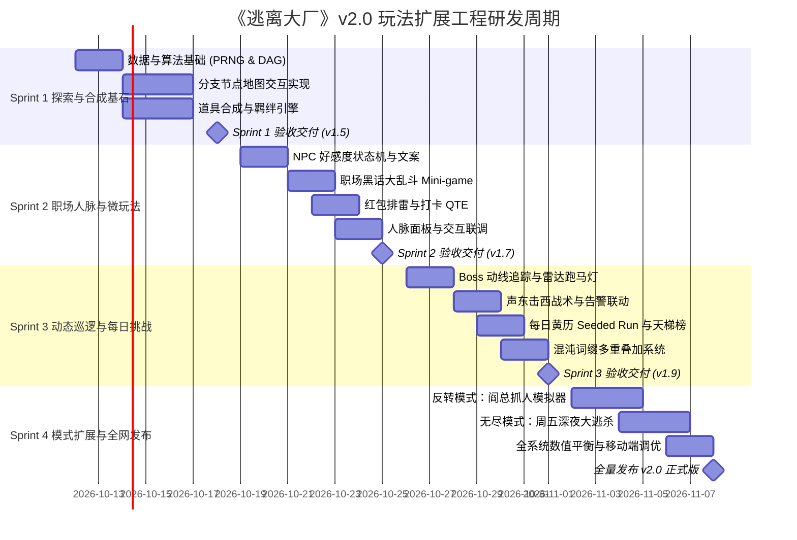
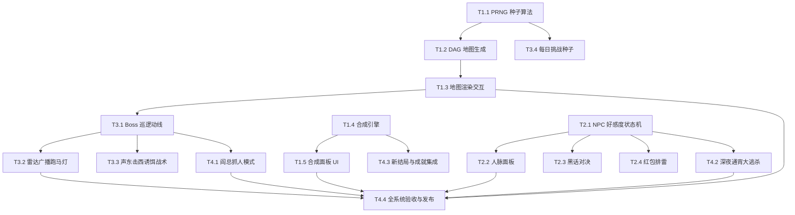

# 《逃离大厂》玩法扩展项目工程排期与里程碑规划（Roadmap & WBS）

> **项目周期**：预计 4 个迭代周期（每个 Sprint 为期 1 周，共 4 周交付）  
> **研发资源基准**：前端/全栈工程师 1~2 人，涵盖逻辑、数值、文案与 UI/动效

---

## 目录
1. [里程碑与版本节奏（Milestones Overview）](#1-里程碑与版本节奏milestones-overview)
2. [工作分解结构（WBS - Work Breakdown Structure）](#2-工作分解结构wbs---work-breakdown-structure)
3. [依赖关系与关键路径（Dependency Matrix）](#3-依赖关系与关键路径dependency-matrix)
4. [质量保障与验收标准（QA & Acceptance Criteria）](#4-质量保障与验收标准qa--acceptance-criteria)
5. [风险评估与应急预案（Risk Management）](#5-风险评估与应急预案risk-management)

---

## 1. 里程碑与版本节奏（Milestones Overview）

---

## 2. 工作分解结构（WBS - Work Breakdown Structure）

### Sprint 1：探索与合成基石（目标版本：v1.5.0-alpha）
*重点攻坚：解决线性流程枯燥问题，建立基础探险框架与道具构筑深度。*

| 任务编号 | 任务名称 | 所涉文件 | 工时预估 | 交付物定义 |
| :---: | :--- | :--- | :---: | :--- |
| **T1.1** | PRNG 算法与种子发生器 | `src/utils/prng.js` | 0.5 天 | Mulberry32 实现，单元测试确保同种子输出一致率 100%。 |
| **T1.2** | DAG 拓扑地图生成器 | `src/engine/mapManager.js`, `src/data/maps.js` | 1.5 天 | 支持 5 层有向无环图动态生成，无孤立节点与死胡同。 |
| **T1.3** | 地图节点渲染与路径交互 | `src/ui/mapView.js`, `src/styles/components.css` | 2.0 天 | 可视化连线与节点状态（已访问、可前往、已封锁），适配触控。 |
| **T1.4** | 道具配方表与合成引擎 | `src/data/recipes.js`, `src/engine/craftManager.js` | 1.5 天 | 支持 8+ 个合成神装配方匹配与效果挂载。 |
| **T1.5** | 合成面板 UI 与动画反馈 | `src/ui/craftModal.js` | 1.5 天 | 拖拽/点击放入原材料，触发“职场化学反应”合成特效音画。 |

---

### Sprint 2：职场人脉与交互微玩法（目标版本：v1.7.0-beta）
*重点攻坚：增强职场打工人沉浸感与策略互动维度，摆脱纯点选按钮体验。*

| 任务编号 | 任务名称 | 所涉文件 | 工时预估 | 交付物定义 |
| :---: | :--- | :--- | :---: | :--- |
| **T2.1** | NPC 好感度状态机与配置 | `src/data/npcs.js`, `src/engine/npcManager.js` | 1.5 天 | 阿伟、老王、阿强、刘姐好感度增减、背叛/盟友状态跃迁。 |
| **T2.2** | 职场人脉面板与专属特权 | `src/ui/relationPanel.js` | 1.5 天 | 人脉关系图谱展示、送礼交互与特权被动激活。 |
| **T2.3** | 黑话大乱斗 Mini-game | `src/data/buzzwords.js`, `src/ui/miniGames.js` | 2.0 天 | 6 选 3 黑话词牌组装，倒计时 6 秒判定与幽默评分反馈。 |
| **T2.4** | 微信红包避雷排雷小游戏 | `src/ui/miniGames.js` | 1.0 天 | 3 个跳动红包动态生成，0.01 元剧毒陷阱与大额红包判定。 |
| **T2.5** | 18:00 完美打卡停表 QTE | `src/ui/miniGames.js`, `src/engine/miniGameRunner.js` | 1.0 天 | 毫秒级秒表滚动动画，Perfect/Early/Late 判定与专属音效。 |

---

### Sprint 3：动态巡逻视野与每日挑战（目标版本：v1.9.0-rc）
*重点攻坚：赋予高管 AI 动线压迫感，引入每日天梯与硬核词缀叠加。*

| 任务编号 | 任务名称 | 所涉文件 | 工时预估 | 交付物定义 |
| :---: | :--- | :--- | :---: | :--- |
| **T3.1** | Boss 巡逻动线引擎 | `src/engine/patrolManager.js` | 1.5 天 | 阎总楼层移动、警戒半径计算、相邻节点威胁判定。 |
| **T3.2** | 巡查雷达跑马灯组件 | `src/ui/radarView.js` | 1.0 天 | 顶部实时通报 Boss 行踪与警报红黄绿状态灯。 |
| **T3.3** | 声东击西战术与环境联动 | `src/data/events.js`, `src/engine/patrolManager.js` | 1.5 天 | 假报警/会议预约转移 Boss 目标，阻断其前进路线。 |
| **T3.4** | 每日职场黄历系统 | `src/data/daily.js`, `src/engine/gameEngine.js` | 1.5 天 | 基于系统日期的种子固化，宜忌加成与每日专属榜单。 |
| **T3.5** | 混沌词缀叠加器 | `src/data/modifiers.js`, `src/ui/renderer.js` | 1.5 天 | 支持 2~3 个词缀组合多选与全局数值重计算。 |

---

### Sprint 4：新模式扩展与全网发布（目标版本：v2.0.0-final）
*重点攻坚：反转玩法与无尽生存模式开发，全量数值平衡与发布上线。*

| 任务编号 | 任务名称 | 所涉文件 | 工时预估 | 交付物定义 |
| :---: | :--- | :--- | :---: | :--- |
| **T4.1** | 反转模式：阎总抓人模拟器 | `src/engine/reverseBossEngine.js`, `src/ui/reverseBossView.js` | 2.5 天 | 扮演阎总抓捕下班员工，技能系统与专属结算。 |
| **T4.2** | 无尽模式：深夜大逃杀 | `src/engine/overtimeEngine.js`, `src/data/overtimeEvents.js` | 2.5 天 | 被抓进会议室后触发熬夜生存关卡（清醒值/存在感平衡）。 |
| **T4.3** | 全结局图鉴与成就扩充 | `src/data/endings.js`, `src/data/achievements.js` | 1.0 天 | 扩充至 25+ 个结局，24+ 个成就，支持生成成就分享海报。 |
| **T4.4** | 移动端性能优化与无损迁移 | `src/engine/gameState.js`, `src/styles/main.css` | 1.0 天 | LocalStorage V1 $\to$ V2 数据迁移器，首屏加载 $< 1\text{s}$。 |

---

## 3. 依赖关系与关键路径（Dependency Matrix）

---

## 4. 质量保障与验收标准（QA & Acceptance Criteria）

### 4.1 核心算法单元测试用例
1. **地图连通性验证**：自动化生成 10,000 个随机地图，确保无任何孤立节点，所有路径终点均可到达一楼闸机（通过率要求：$100\%$）。
2. **种子确定性测试**：给定相同种子字符（例如 `2026-10-09`），在 Chrome、Safari、Firefox 下生成的节点类型分布、NPC 分布完全一致。
3. **配方哈希无死角**：验证任意乱序放入配方原料（如 `[A, B]` 或 `[B, A]`），均能准确匹配同一件合成产物。

### 4.2 交互与性能验收指标
* **移动端适配**：在主流机型（iOS Safari、Android Chrome / 微信内置浏览器）下字体不产生形变，所有按钮触控区域均 $\ge 44 \times 44\text{px}$。
* **高帧率与低能耗**：动画与时间滚动 QTE 维持在稳定 60 FPS，无主线程长任务阻塞（Long Task $< 50\text{ms}$）。
* **存档安全保障**：异常断电或关机时，LocalStorage 能保留当前回合最新状态，读取老版本 V1 存档能够 $100\%$ 正常继承悟性点与解锁成就。

---

## 5. 风险评估与应急预案（Risk Management）

| 潜在风险点 | 影响程度 | 发生概率 | 应对与缓解方案 |
| :--- | :---: | :---: | :--- |
| **地图复杂度过高导致新手迷茫** | 高 | 中 | 开局前 2 局强制固定初学者向导路线；高危路线前增加醒目的 `⚠️ 极度危险` 标签警告。 |
| **微玩法（黑话/QTE）降低节奏感** | 中 | 中 | 设置轻量跳过按钮（Skip）；在设置面板中提供【快速文本模式】，允许老玩家直接自动掷骰判定。 |
| **反转模式代码量膨胀与工时超期** | 中 | 高 | 将 Sprint 4 中的【阎总抓人模式】作为独立 DLC / 实验性功能分支（Feature Flag）控制，若进度紧张可平滑移入 v2.1 规划。 |
| **旧存档结构兼容崩溃** | 极高 | 低 | 在 `GameState.js` 启动入口增加 Try-Catch 兜底回滚机制，若解析失败自动备份并写入默认安全存档，避免白屏。 |
