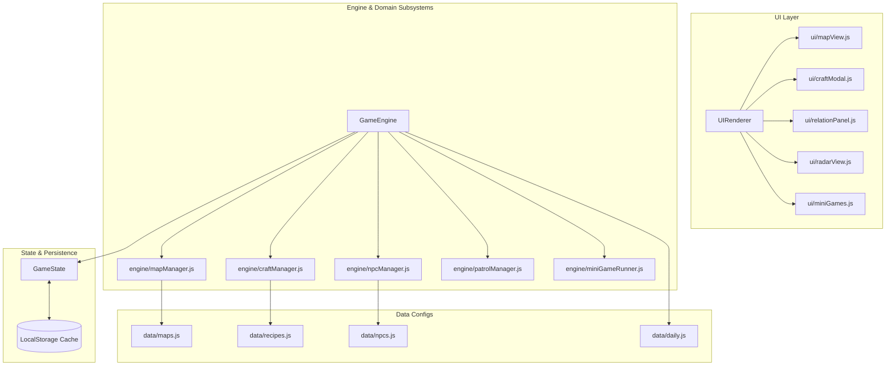

# 《逃离大厂》玩法扩展技术设计与架构规范（TDD）

> **技术栈**：Vite 5+, Vanilla ES Modules (JS), Modern CSS (Flexbox/Grid/Animations), Web Audio API, LocalStorage  
> **设计模式**：发布-订阅（Pub/Sub Observer）、状态机（Finite State Machine）、组件化模块渲染

---

## 目录
1. [系统总体架构与模块划分](#1-系统总体架构与模块划分)
2. [数据模型与契约定义（Data Contracts）](#2-数据模型与契约定义data-contracts)
3. [核心算法与逻辑实现](#3-核心算法与逻辑实现)
4. [核心引擎（GameEngine & GameState）改造方案](#4-核心引擎gameengine--gamestate改造方案)
5. [UI 渲染组件层扩展设计](#5-ui-渲染组件层扩展设计)
6. [数据存储与版本迁移（LocalStorage Migration）](#6-数据存储与版本迁移localstorage-migration)

---

## 1. 系统总体架构与模块划分

为了保持纯前端极轻量、快速加载、无依赖（Zero Dependency）的特性，系统采用模块化分治架构：



### 1.1 新增/重构文件清单
```text
src/
├── data/
│   ├── recipes.js         # 道具合成配方表与羁绊定义
│   ├── npcs.js            # NPC 初始配置、阵营、喜好道具与特权
│   ├── buzzwords.js       # 职场黑话库、词性权重与评分矩阵
│   └── daily.js           # 每日黄历宜忌与种子词缀生成规则
├── engine/
│   ├── mapManager.js      # DAG 随机拓扑地图生成器与寻路逻辑
│   ├── npcManager.js      # 好感度增减、背叛/盟友状态转移逻辑
│   ├── craftManager.js    # 背包合成配方匹配引擎
│   ├── patrolManager.js   # Boss 动线模拟、视野告警与诱饵判定
│   └── miniGameRunner.js  # 黑话对决、抢红包排雷、打卡 QTE 状态机
├── ui/
│   ├── mapView.js         # 节点地图交互组件（类尖塔连线视图）
│   ├── craftModal.js      # 道具合成拖拽/点击交互弹窗
│   ├── relationPanel.js   # 职场人脉好感度与盟友面板
│   ├── radarView.js       # 顶部高管动态通报走字条与雷达预警
│   └── miniGames.js       # 3款交互微玩法的轻量渲染与计时器
└── utils/
    └── prng.js            # 确定性伪随机数发生器（Mulberry32）
```

---

## 2. 数据模型与契约定义（Data Contracts）

### 2.1 节点地图数据模型（`MapNode` & `MapGraph`）
```javascript
/**
 * @typedef {'action' | 'loot' | 'rest' | 'event' | 'secret'} NodeType
 * 
 * @typedef {Object} MapNode
 * @property {string} id - 节点唯一UUID，如 'node_z2_1'
 * @property {number} depth - 所在层级 [0, 4]
 * @property {NodeType} type - 节点功能类型
 * @property {string} title - 节点名称，如 "吸烟区露台"
 * @property {string} icon - Emoji 图标
 * @property {string[]} nextNodeIds - 下一层可前往的节点 ID 数组
 * @property {boolean} isVisited - 是否已探索过
 * @property {boolean} isAvailable - 当前回合是否可选
 * @property {boolean} hasBossThreat - 是否处于高管重点巡查路线
 */
```

### 2.2 NPC 人脉数据模型（`NPCRelation`）
```javascript
/**
 * @typedef {Object} NPCRelation
 * @property {string} id - 'ah_wei' | 'lao_wang' | 'ah_qiang' | 'liu_jie' | 'admin_girls'
 * @property {string} name - 角色名
 * @property {number} favorability - 好感度数值 [-100, 100]
 * @property {'ally' | 'friendly' | 'neutral' | 'hostile' | 'nemesis'} status - 关系阶梯
 * @property {string[]} favoriteItems - 最喜爱的收买道具 ID 列表
 * @property {boolean} hasGrantedPerk - 是否已激活满级专属特权
 */
```

### 2.3 道具合成配方模型（`CraftRecipe`）
```javascript
/**
 * @typedef {Object} CraftRecipe
 * @property {string} id - 配方唯一标识
 * @property {string[]} ingredients - 所需原料道具 ID（长度为 2 或 3，无序）
 * @property {string} resultItemId - 产物道具 ID
 * @property {string} name - 合成神装名称
 * @property {string} synergyDesc - 羁绊特技描述
 * @property {string} unlockAchievement - 关联成就 ID
 */
```

### 2.4 高管巡逻动线模型（`PatrolState`）
```javascript
/**
 * @typedef {Object} PatrolState
 * @property {string} bossId - 'boss_yan'
 * @property {number} currentFloor - 当前所在楼层（如 19, 18, 1）
 * @property {string} currentZoneId - 当前所在区域或地图节点 ID
 * @property {number} movementCountdown - 距离下次移动的剩余回合数
 * @property {'roaming' | 'alert' | 'distracted'} behaviorState - 行动状态
 * @property {string|null} distractedTarget - 被声东击西诱导的目标节点
 * @property {number} distractedTurns - 诱导剩余有效回合
 */
```

---

## 3. 核心算法与逻辑实现

### 3.1 确定性伪随机数发生器（PRNG / Mulberry32）
用于保证**每日挑战（Daily Run）**在不同设备上生成完全一致的地图、词缀与事件分布：

```javascript
// src/utils/prng.js
export class PRNG {
  constructor(seed) {
    this.seed = this.hashString(seed);
  }

  hashString(str) {
    let h = 2166136261 >>> 0;
    for (let i = 0; i < str.length; i++) {
      h = Math.imul(h ^ str.charCodeAt(i), 16777619);
    }
    return h >>> 0;
  }

  // 返回 [0, 1) 的确定性伪随机数
  random() {
    let t = (this.seed += 0x6d2b79f5);
    t = Math.imul(t ^ (t >>> 15), t | 1);
    t ^= t + Math.imul(t ^ (t >>> 7), t | 61);
    return ((t ^ (t >>> 14)) >>> 0) / 4294967296;
  }

  // 辅助：指定区间随机整数 [min, max]
  randInt(min, max) {
    return Math.floor(this.random() * (max - min + 1)) + min;
  }
}
```

### 3.2 拓扑地图生成算法（DAG Layered Generation）
```javascript
// src/engine/mapManager.js
import { PRNG } from '../utils/prng.js';

export function generateDungeonMap(seedString) {
  const prng = new PRNG(seedString);
  const layers = [1, 3, 3, 2, 1]; // 每层的节点数量分布
  const map = [];

  // 1. 生成所有层级的节点
  layers.forEach((count, depth) => {
    const layerNodes = [];
    for (let i = 0; i < count; i++) {
      layerNodes.push({
        id: `node_${depth}_${i}`,
        depth,
        index: i,
        type: pickNodeType(depth, prng),
        nextNodeIds: [],
        isVisited: depth === 0,
        isAvailable: depth === 0
      });
    }
    map.push(layerNodes);
  });

  // 2. 建立层级之间的前向连接（保证连通性，消除孤立点）
  for (let d = 0; d < layers.length - 1; d++) {
    const currentLayer = map[d];
    const nextLayer = map[d + 1];

    currentLayer.forEach((node, i) => {
      // 至少连接一个下一层相邻节点
      const targetIndex = Math.min(i, nextLayer.length - 1);
      node.nextNodeIds.push(nextLayer[targetIndex].id);

      // 有 45% 概率额外连接相邻分支，增加策略丰富度
      if (prng.random() < 0.45 && targetIndex + 1 < nextLayer.length) {
        node.nextNodeIds.push(nextLayer[targetIndex + 1].id);
      }
    });

    // 反向校验：确保下一层的每个节点至少有一个来自上一层的父节点
    nextLayer.forEach((nextNode) => {
      const hasParent = currentLayer.some((p) => p.nextNodeIds.includes(nextNode.id));
      if (!hasParent) {
        // 随机选择上一层就近节点接入
        const randomParent = currentLayer[prng.randInt(0, currentLayer.length - 1)];
        randomParent.nextNodeIds.push(nextNode.id);
      }
    });
  }

  return map;
}

function pickNodeType(depth, prng) {
  if (depth === 0) return 'action';
  if (depth === 4) return 'boss';
  const roll = prng.random();
  if (roll < 0.35) return 'action';
  if (roll < 0.60) return 'loot';
  if (roll < 0.80) return 'rest';
  if (roll < 0.95) return 'event';
  return 'secret';
}
```

### 3.3 无序道具合成配方匹配算法
```javascript
// src/engine/craftManager.js
import { RECIPES } from '../data/recipes.js';

export function matchRecipe(selectedItemIds) {
  if (!selectedItemIds || selectedItemIds.length < 2) return null;

  // 将玩家选中的道具 ID 排序后拼装为唯一签名 key
  const sortedInputKey = [...selectedItemIds].sort().join('|');

  return RECIPES.find((recipe) => {
    const sortedRecipeKey = [...recipe.ingredients].sort().join('|');
    return sortedInputKey === sortedRecipeKey;
  }) || null;
}
```

### 3.4 QTE 毫秒时间窗口高精度捕获
```javascript
// src/engine/miniGameRunner.js
export function evaluateClockOutQTE(targetTimestamp, clickedTimestamp) {
  const diffMs = clickedTimestamp - targetTimestamp; // 毫秒差

  // 17:59:59.800 到 18:00:00.500 为 Perfect 窗口 (-200ms ~ +500ms)
  if (diffMs >= -200 && diffMs <= 500) {
    return { grade: 'PERFECT', scoreBonus: 2.0, msg: '⏱️ 神仙准点打卡！分秒不差，完美压线！' };
  } else if (diffMs < -200) {
    return { grade: 'EARLY', scoreBonus: 0.5, msg: '🚨 提示早退！考勤大喇叭通报，大厅保安闻声而来！' };
  } else {
    return { grade: 'LATE', scoreBonus: 0.8, msg: '⚠️ 略微延迟！电梯口涌出加班大部队，行动受阻！' };
  }
}
```

---

## 4. 核心引擎（GameEngine & GameState）改造方案

### 4.1 `GameState` 状态树扩展
在 `src/engine/gameState.js` 中新增对应子状态树，并在 `reset()` 中统一初始化：

```javascript
// 扩展状态树结构
this.mapGraph = null;           // 当前局随机 DAG 地图
this.currentMapNodeId = null;   // 当前停留节点
this.npcRelations = {};         // 各 NPC 好感度字典
this.patrolState = {            // Boss 巡逻追踪状态
  floor: 18,
  zone: 'corridor',
  threatLevel: 'medium',
  distractedTurns: 0
};
this.dailySeed = null;          // 若为每日模式，记录种子
this.chaosModifiers = [];       // 多重词缀列表
```

### 4.2 观察者事件通知机制（Pub/Sub）
将目前单一的 `state.notify()` 扩展为支持按频道精细化触发重绘，避免局部数据变动引起全屏重新渲染：
```javascript
// src/engine/gameState.js
subscribe(channel, callback) {
  if (!this.channels) this.channels = {};
  if (!this.channels[channel]) this.channels[channel] = [];
  this.channels[channel].push(callback);
}

emit(channel, payload) {
  if (this.channels && this.channels[channel]) {
    this.channels[channel].forEach((cb) => cb(payload));
  }
}
```
* **支持频道**：`'map:update'`, `'inventory:change'`, `'npc:favor_change'`, `'patrol:move'`, `'encounter:trigger'`。

---

## 5. UI 渲染组件层扩展设计

### 5.1 视口响应式布局方案（CSS Grid + Flex）
* **移动端（Mobile First，`< 768px`）**：
  * 地图视图支持横向滑动，节点支持大触控点击（尺寸 $\ge 48\text{px} \times 48\text{px}$）；
  * 顶部常驻跑马灯式【高管动向雷达】（高度 36px，半透明高斯模糊背景）；
  * 底部 Tab 栏增加【人脉】与【合成】快捷悬浮气泡徽章。
* **桌面端（`>= 768px`）**：
  * 左侧展示玩家属性、状态与当前节点行动；
  * 中部展示主剧情日志与互动选择；
  * 右侧固定展示全景节点地图、Boss 雷达与职场关系网。

---

## 6. 数据存储与版本迁移（LocalStorage Migration）

### 6.1 Schema 存储格式定义
```javascript
const STORAGE_KEY = 'ESCAPE_WORK_SAVE_V2';

const defaultSaveV2 = {
  version: 2,
  meta: {
    totalRuns: 0,
    escapedRuns: 0,
    totalExp: 0,
    unlockedPerks: [],
    unlockedEndings: [],
    unlockedRecipes: [], // 新增：已解锁合成配方图鉴
    dailyHighScores: {}  // 新增：每日挑战历史积分榜
  },
  settings: {
    soundEnabled: true,
    hapticsEnabled: true,
    fastText: false
  }
};
```

### 6.2 向下兼容迁移器（Migrator）
若检测到用户本地存在 `v1` 数据（老版本的成就和天赋），自动执行无损数据合并：
```javascript
export function migrateSaveData() {
  const oldDataStr = localStorage.getItem('ESCAPE_WORK_SAVE');
  const v2DataStr = localStorage.getItem(STORAGE_KEY);

  if (!v2DataStr && oldDataStr) {
    try {
      const oldData = JSON.parse(oldDataStr);
      const migrated = {
        ...defaultSaveV2,
        meta: {
          ...defaultSaveV2.meta,
          totalRuns: oldData.totalRuns || 0,
          totalExp: oldData.exp || 0,
          unlockedPerks: oldData.unlockedPerks || [],
          unlockedEndings: oldData.endings || []
        }
      };
      localStorage.setItem(STORAGE_KEY, JSON.stringify(migrated));
      console.log('[Migration] Successfully migrated save data from V1 to V2.');
    } catch (e) {
      console.error('[Migration] Failed to migrate old save data:', e);
    }
  }
}
```
